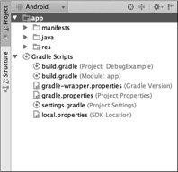
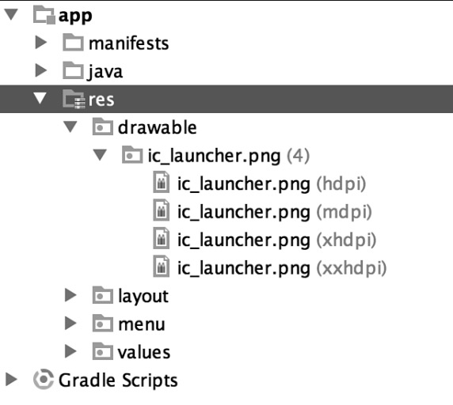

#第3章
#应用结构

伴随着支持的开发平台从ADT bundle转向Android Studio的决定,也带来了开始使用Gradle作为编译系统的决定。
这打开了许多开发者开始以更多合作的方式组装Android应用的大门，并且改变了之前项目构建的文件结构。

在本章中，你将会学到新的文件系统结构以及项目中使用到的文件类型，包括XML文件,图片资源,还有Gradle编译文件的存放位置。

当你在Android Studio中创建应用程序时，你会发现项目分为App文件夹和Gradle脚本文件。

图3.1 所示结构



图3.1  显示在项目面板中的 App文件夹和Gradle 脚本。

在App文件夹中有三个子文件夹，用于存放应用程序中的文件和资源。他们是隔离开的，所以很容易确定资源所在的位置，然而，新手或者从Eclipse转移过来的开发者可能不清楚文件的存放位置，为了使这更容易，我将带你逐一到访每个文件夹，去了解它所包含的内容。

##Manifests(清单文件)

清单文件夹很符合它的名字， 这里放置了你的清单文件，根据你的目标，你可能有一个或多个清单文件，
你可能有多个清单文件对应于应用的版本，或者支持特定的硬件。

清单文件是由你创建项目的时候被Android Studio生成的， 列表3.1显示了生成的清单文件。

列表3.1 从Android Studio 生成的清单文件

```
   <?xml version="1.0" encoding="utf-8"?>
   <manifest xmlns:android="http://schemas.android.com/apk/res/android"
   package="com.dutsonpa.helloandroid" >
   <application
   android:allowBackup="true"
   android:icon="@drawable/ic_launcher"
   android:label="@string/app_name"
   android:theme="@style/AppTheme" >
   <activity
   android:name=".MainActivity"
   android:label="@string/app_name" >
   <intent-filter>
   <action android:name="android.intent.action.MAIN" />
   <category android:name="android.intent.category.LAUNCHER" />
   </intent-filter>
   </activity>
   </application>
   </manifest> 
```

如果你之前用到过Android的清单文件，那么你看到这些应该很熟悉，这是一个以 <?xml version="1.0" encoding= “utf-8”?>声明开始的XML文件，这样做是为了使应用程序知道如何处理包含在文件中的信息。因为它被声明为一个XML文件，你会发现文件中的选项和设置是由很多包含属性的元素组成的。在声明之后的下一个元素是一个典型的例子。

在 <manifest> 元素中包含一些属性： Android使用的XML命名空间和应用程序的包名称。
包名称是启动项目的时候创建的。在 <manifest> 元素中同样还可以包含子元素。

在清单3.1中，只有一个子元素：<application>元素。它包含更多的属性，这些属性将会影响到应用程序的显示，以及是否允许用户对应用程序进行备份。其他子元素包括应用程序使用到的 Activity, Intent, Provider, Receiver, Service等。

清单文件中还可以包含其他元素，例如 <uses-permission> 。这个元素对于应用开发人员来说是毒药也是解药。通过它允许应用程序访问一些系统功能，你可以创建很神奇的应用，让用户访问任何他们想要的，不幸的是当他们安装应用程序时，在安装页面会显示一些非常可怕的消息。
用户更喜欢去安装只请求必要权限以完成任务的应用，而不是请求一堆权限的应用，这样保证了不会危害到用户或者个人数据。

>注意
>你可能在你的应用程序中已经使用过<compatible-screens>元素来给特定的屏幕尺寸使用。这种做法不再被推荐使用。你应该使用不同的布局资源，让尽可能多的用户享受和使用你的应用程序。

由于XML的特质，在其中添加或删除元素的时候顺序并不重要，等同于父子关系。但是，请注意，官方文档的列表中显示在下面的伪代码是被排好顺序的：


```
 <manifest>
 <uses-permission />
 <permission />
 <permission-tree />
 <permission-group />
 <instrumentation />
 <uses-sdk />
 <uses-configuration />
 <uses-feature />
 <supports-screens />
 <compatible-screens />
 <supports-gl-texture />
 <application>
 <activity>
 <intent-filter>
 <action />
 <category />
 <data />
 </intent-filter>
 <meta-data />
 </activity>
 <activity-alias>
 <intent-filter></intent-filter>
 <meta-data />
 </activity-alias>
 <service>
 <intent-filter></intent-filter>
 <meta-data/>
 </service>
 <receiver>
 <intent-filter></intent-filter>
 <meta-data />
 </receiver>
 <provider>
 <grant-uri-permission />
 <meta-data />
 <path-permission />
 </provider>
 <uses-library />
 </application>
 </manifest> 
 ```
 
你可能会想创造并添加自己的元素；但是，你应该知道，清单文件是被解析为特定的元素的集合，当出现自定义的元素会导致错误。同样在元素中使用自定义的属性也会引发错误。

##Java
 
java文件夹是不言自明。在这里，你将存储所有项目用到的java文件。

所有的类都将在这里，Android Studio将会把文件和包路径绑定在一起，这样就可以不用在文件夹下面找来找去了。

你的类文件不用仅限于放在根目录，就像开发其他的java应用一样，你可以自由的创建子目录，然后把类文件放在对应的目录中。

例如，如果你在做数据库连接的工作，并希望所有的数据类驻留在一个易于使用存储的位置，你可以创建一个“Data”文件夹，里面存放你的类文件。

根据你创建应用程序的方式，你可以在你的MainActivity中导入Java类使用。如果我创建了一个名为MyDB的数据库相关的类文件，并把它放在“data”文件夹中，我将会使用下面的语句导入到我的MainActivity中：

```
 import com.dutsonpa.HelloAndroid.data.MyDB;
```

当你使用在自己的项目时，你需要更改域（dutson）和应用程序名称（HelloAndroid）为你的项目中所用到的。

##Res (Resources) (资源)

清单文件夹和java文件夹，到此已经包含了能被安装的应用程序的必要部分和应用程序的逻辑部分。 
在“res”文件夹中，通过改变里面的内容，控制在应用中用到的布局，媒体和常量等。
该文件夹的命名就是因为包含所有应用程序所依赖的资源。它包含的文件夹可以帮助你对应用程序的资源进行分离和排序。
 
##Drawable(图片)

drawable 文件夹包含所有应用中用到的视觉媒体和资源。表3.1列出了 你可以放在这个文件夹下使用的drawable类型

表3.1  Drawable文件夹下的资源文件

Drawable 资源 | 文件类型
 --- | ---
Bitmap | 图片文件（例如 .jpg, .png, and .gif).
Clip Drawable | 由多个点组成，和另一个drawable结合创建一个裁剪对象的XML文件
Insert Drawable | 用于在一个drawable中放置另一个drawable的XML文件
Layer List | 包含一组其他的drawable文件的XML文件，注意，drawable集合将会把第一个在最底部按照顺序绘制。
Level List | 一个用于显示一组drawables的XML文件，可以通过setImageLevel()方法设置level来控制显示。
Nine-Patch | 基于内容的大小可伸展特定部分的PNG图像文件。
Scale Drawable | 一个包含drawable的XML文件，可以根据当前的值改变另一个drawable的尺寸。
Shape Drawable | 包含几何形状，颜色，大小和类似属性值的XML文件。
State List | 一个用于显示多个图像或不同状态图像的XML文件。
Transition Drawable | 包含一个可以在两个条目之间进行转换的drawable的XML文件。

当使用Android Studio的时候，要知道，不是所有的文件夹都可以显示你的资源。在你的文件系统中，你可能有分为drawable，drawable-hdpi, drawable-mdpi 和drawable-xhdpi 的文件夹，分别包含同名的资源文件，但是使用在在不同的显示密度上，在Android Studio中 这个资源文件将会被显示在可以展开的 drawable文件夹中，资源文件在括号中标识了使用场景。
图3.2展示了在Android Studio中依赖于像素密度的同名资源是如何显示的。



图3.2  ic_launcher.png文件存在于多个文件夹中，但是主资源展开的时候显示为一个带指定密度的单一资源。

##Layout(布局)

布局文件夹是用于存放布局的XML文件的。默认的布局文件，是根据你的Activity的名字命名，如果你在Android Studio中创建了一个新的项目，并选择了默认设置， 默认的布局文件会是activity_main.xml。

这个文件用于建立你的Activity的布局，也用于其他的布局、组件、widgets（窗体小控件），和asset类似，是为你的应用的UI 服务的。

与 drawable文件夹类似，你可能有多个布局文件夹来处理不同的设备，对于拥有更多或更少的屏幕空间的设备，这会很有帮助。
习惯于用 Fragment 来处理页面布局变化的开发者将会很高兴，因为他们可以使用一个分离的layout文件自动处理，而不是不得不使用一个Fragment处理，

基于屏幕大小使用一个分离的layout的时候， 你需要基于设备宽高的dp单位指定对应的layout，并且放在对应文件名的文件夹中。
DP单位代表独立密度像素。这个单位允许你使用相对的测量结果，从而在使用不同的像素的时也能正常显示，例如平板是7寸的或者更大，通长宽度有600dp的单位，这让你能创建一个 layout-sw600dp文件夹，放置你的布局文件在这里，当应用运行时，将会检查应该使用哪个Layout 在设备上显示合适的页面。

布局 也可以被基于dpi(每英寸内包含点数) 的屏幕密度所对应的文件夹来支持，列表如下：

 * ldpi: 当屏幕为120dpi的时候使用。
 * mdpi: 当屏幕为160dpi的时候使用。
 * hdpi: 当屏幕为240dpi的时候使用。
 * xhdpi: 当屏幕为320dpi的时候使用。
 * xxhdpi: 当屏幕为480dpi的时候使用。
 * xxxhdpi:当屏幕为640dpi的时候使用。
 * nodpi: 可以在所有的密度中使用。
 * tvdpi: 当屏幕大小介于mdpi和hdpi之间，213dpi左右的大小的时候使用。
  	
 
##Menu(菜单)

如果你选择在你的应用中创建或添加一个菜单，定义菜单中的XML存放在此文件夹中。你可以决定创建你的想要的菜单的名字，但是如果你在Android Studio中使用默认配置创建了一个新项目,你会发现，你的菜单被命名menu_main.xml。

这个命名规则其实是很有帮助的，因为它标识了XML文件用于“菜单”的，并且对应activity 是“main”。

##Values

Values文件夹用于记录在应用程序中使用到的值。要创建一个易于维护的应用的时候，强烈建议不要在代码中使用硬编码的值。而是在values文件夹下面的XML文件中存放。

这是一个示例：

```
// 硬编码的资源
 <TextView
 android:text="Hello Android!"
 android:layout_width="wrap_content"
 android:layout_height="wrap_content" />
 // 使用 /res/values/strings.xml 值
 <TextView
 android:text="@string/hello_android"
 android:layout_width="wrap_content"
 android:layout_height="wrap_content" /> 
```

在前面的例子中，在TextView的所显示的值是根据strings.xml中的值进行改变，
下面是一个strings.xml文件的例子：

```
 <?xml version="1.0" encoding="utf-8"?>
 <resources>
 <string name="hello_android">Hello Android!</string>
 </resources> 
```

当你创建了Android Studio的一个新项目，下面的XML文件会自动生成：

 * dimens.xml
 * stings.xml
 * styles.xml
 
通过查看这些文件，你会发现，他们每个都是以<resources>为父元素的XML文件。这可能会让你想到你可以放置所有的value在同一个xml文件中并且在你的应用中使用它。
虽然这样做是可行的，但是为了便于维护你的应用，准确地定位数据所在的位置，我们强烈建议你拆开你的value到多个文件。
下面列表中的文件可以使用在应用程序中，用来存放不同的值：
  
 * arrays.xml
 * colors.xml
 * dimens.xml
 * strings.xml
 * styles.xml

每个文件被清楚地命名，这样你会确切地知道你正在处理什么数据。此外，每个文件的元素都是在父元素<resource>之内。例如，颜色值将放在<Resource>元素的子元素<color>中。

##Other Resources(其他资源)

你可以在应用中创建的其他资源对应的文件夹。
表3.2列出了每个文件夹的名称，以及应该存放什么资源。

表3.2 应用资源文件夹

Folder Name | Folder Contents
 --- | ---
animator | 属性动画的XML文件
anim | 补间动画的XML文件 
color | 存放颜色状态集合的XML文件
raw | 存放能被AssetManager读取的文件
xml | 在应用中被Resources.getXML()用到的任何XML文件

>提醒
>你可能想知道在什么地方存放应用程序使用的音频文件。你可以将它们放置在 /res/raw，并通过R.raw.audio_file访问它们。免于使用其他的项目文件夹，这样做保持了资源文件夹是条理清晰的。


##Gradle

同Android Studio一起，做出了构建项目的任务从Ant迁移到了Gradle的决定。为了帮助你管理你的构建文件，Android Studio添加了一个名为Gradle的脚本在你的项目中。展开Gradle脚本文件，你会看到你的构建配置文件、属性和设置文件。

当你要迁移一个Android Studio创建的项目的时候，你也许会发现你需要调整一些配置去匹配新的Gradle版本或者使用到的构建工具。你可以通过查看 app文件夹里的build.grade 了解当前的配置，列表3.2显示了一个构建文件的示例。

列表3.2 一个Android应用的build.gradle文件

```
apply plugin: 'com.android.application'
 android {
 compileSdkVersion 21
 buildToolsVersion "21.1.2"
 defaultConfig {
 applicationId "com.dutsonpa.helloandroid"
 minSdkVersion 15
 targetSdkVersion 21
 versionCode 1
 versionName "1.0"
 }
 buildTypes {
 release {
 minifyEnabled false
 proguardFiles getDefaultProguardFile('proguard-android.txt'),
 'proguard-rules.pro'
 }
 }
 }
 dependencies {
 compile fileTree(dir: 'libs', include: ['*.jar'])
 compile 'com.android.support:appcompat-v7:21.0.3'
 } 
```

当你迁移或升级应用，需要重点关注的是compileSdkVersion，buildToolsVersion，minSdkVersion和targetSdkVersion。如果这些数字和你的应用要安装的系统不匹配，你将会看到编译错误，你的应用程序将无法在模拟器或设备上运行甚至编译。

其他的 Gradle 文件在你的项目构建和编译完成的时候，是由Android Studio进行管理和更新的。
如果你想了解更多关于 Gradle，请访问官方网站：https://gradle.org/。

##Summary(概要)

在本章中，你学习到了构成Android应用的组件。学习到了作为开发集成环境从Eclipse的ADT插件到Android Studio的变化、项目结构和存储在不同位置的应用资产，学习到了关于应用的清单文件和里面包含的各种各样的元素，例如权限元素可以允许你的应用能访问系统的资源，进一步扩展应用程序的功能。

你也学习到了，你可以使用基于设备屏幕密度的文件夹存放指定设备的资产。
这可以让你创建特定的布局给多种设备使用，而不用求助于Fragment来处理布局的变化。

最后，学习到了Android Studio中使用的 Gradle 构建系统，通过对环境的配置可以避免一些问题。


